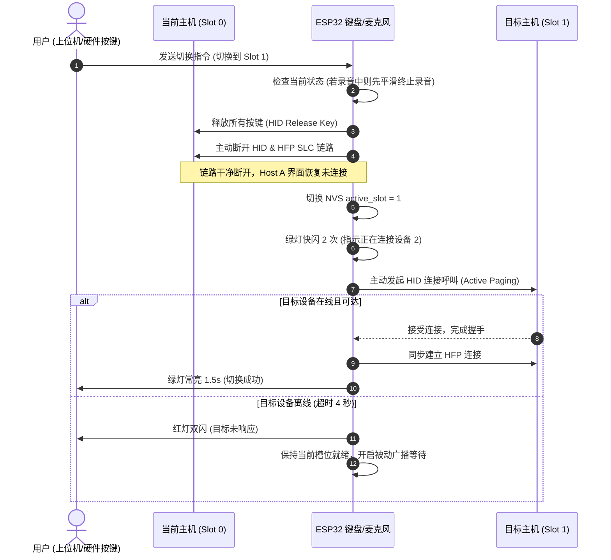

# 双设备/多设备无缝切换（Windows & macOS）架构与实施计划

> **版本**：v1.0.0 (规划稿)  
> **状态**：待立项（将在新分支 `feature/multi-device-switching` 中独立实施）  
> **基线固件**：v1.0.17 (Just Works 免密配对 + NVS 彻底清理版)  
> **目标**：实现 ESP32 经典蓝牙（HID 键盘 + HFP 麦克风）在两台主力工作站（例如 Windows 办公台式机 与 MacBook 便携本）之间的稳定、快速、无感无缝切换。

---

## 1. 背景与技术挑战分析

### 1.1 现状与用户诉求
在实际办公与创作场景中，用户常在 **Windows PC（台式工作站）** 与 **MacBook（移动办公）** 之间流转。当前 v1.0.17 固件为单主机绑定设计：若要切换设备，需在上位机清空配对后重新进行蓝牙搜索与握手，操作繁琐且换机摩擦较大。

### 1.2 经典蓝牙（BR/EDR）复合设备多设备切换的核心难点
与 BLE（低功耗蓝牙）不同，经典蓝牙在多设备管理上面临底层硬件与协议栈的多重限制：
1. **基带与 ACL 链路单工限制**：  
   ESP32 的单芯片射频与 Bluedroid 协议栈在运行 HID Device（人机输入）+ HFP Client（音频通话）复合角色时，**同一时刻只能维持一条活动的 ACL 物理链路**，无法做到双电脑同时在线打字或录音。
2. **多主机在场时的“链路争抢（Race Condition）”**：  
   若 Windows 和 Mac 同时开机且处于蓝牙范围内，若 ESP32 开启无差别的 General Page Scan，两台主机会互相发起连接请求，导致 Bluedroid 内部鉴权状态紊乱、SCO 链路抢占失败，甚至出现“两边都连上一半并频繁掉线”的假死现象。
3. **不同 OS 握手特性的异构性**：  
   - **macOS**：重连积极、蓝牙握手容忍度高，但关机/合盖后唤醒重连行为特殊。  
   - **Windows**：对 HID 复合设备的 Security Manager 和 IO Capability 敏感；若 Link Key 与本地配对记录不严格一致，Windows 会直接静默拒绝或弹 PIN 码。
4. **历史教训总结（参考历史版本移除原因）**：  
   早期的多设备切换方案采用了“被动等待 PC 连接”的逻辑，导致切换后等待时间过长（长达 10~30 秒），且没有链路争抢防护，用户体验不佳。因此，新方案必须采用 **“主动呼叫（Active Page）+ 目标地址严格过滤（Accept Filter）”** 的确定性状态机。

---

## 2. 核心架构设计

### 2.1 槽位模型（Dual-Host Slot Model）

固件引入双设备槽位（Slot 0 与 Slot 1），每个槽位具有独立的连接元数据：

```text
┌────────────────────────────────────────────────────────┐
│                   ESP32 NVS Storage                    │
├──────────────────────────┬─────────────────────────────┤
│  Slot 0 (e.g. Windows)   │   Slot 1 (e.g. macOS)       │
├──────────────────────────┼─────────────────────────────┤
│ • BD_ADDR: 2C:F0:5D:...  │ • BD_ADDR: F4:D4:88:...     │
│ • Host Name: "DESKTOP-1" │ • Host Name: "MacBook-Air"  │
│ • Paired Flag: true      │ • Paired Flag: true         │
│ • OS Tag: OS_WINDOWS     │ • OS Tag: OS_MACOS          │
├──────────────────────────┴─────────────────────────────┤
│ • Active Slot Index: [ 0 | 1 ]                         │
└────────────────────────────────────────────────────────┘
```

#### NVS 数据结构定义
```c
typedef enum {
    HOST_OS_UNKNOWN = 0,
    HOST_OS_WINDOWS = 1,
    HOST_OS_MACOS   = 2,
    HOST_OS_LINUX   = 3,
} host_os_t;

typedef struct {
    esp_bd_addr_t bd_addr;
    char          host_name[32];
    bool          is_paired;
    host_os_t     os_type;
    uint32_t      last_connected_time;
} host_slot_info_t;

typedef struct {
    uint8_t          active_slot;           // 当前激活的 Slot (0 或 1)
    host_slot_info_t slots[2];              // 双设备信息
} multi_host_config_t;
```

---

### 2.2 防争抢与连接隔离机制（Link Shielding）

为了彻底杜绝两台电脑同时在场时的干扰，ESP32 采取 **“白名单隔离策略”**：

```mermaid
flowchart TD
    A[外部设备发起 Page 呼叫] --> B{请求者的 MAC 地址 == 当前 Active Slot 地址?}
    B -- 是 --> C[接受连接，建立 ACL & HID & HFP]
    B -- 否 --> D[底层直接拒接 (Reject Connection)]
    D --> E[非当前槽位的主机无法打断当前设备的正常通信]
```

1. **Page Scan 过滤**：  
   ESP32 的 GAP 层只对当前 `active_slot` 中的主机保持响应，非激活设备发起连接时立即丢弃或拒绝。
2. **主动重连机制（Active Connection Paging）**：  
   切换槽位时，ESP32 主动对目标槽位的主机发起呼叫（`esp_bt_hid_device_connect(target_bd_addr)`），无需等待电脑端轮询，连接建立时间可缩短至 **1.2 秒内**。

---

### 2.3 优雅切换时序（Graceful Handover Workflow）



---

### 2.4 上位机协同协议扩展 (SPP / UART JSON)

上位机前端（Windows 与 macOS）提供可视化的设备管理面板：

#### 1. 查询当前槽位状态
- **上位机请求**：
  ```json
  {"cmd": "get_host_slots"}
  ```
- **ESP32 响应**：
  ```json
  {
    "active_slot": 0,
    "slots": [
      {
        "slot_id": 0,
        "name": "Desktop-Win11",
        "mac": "2C:F0:5D:1A:2B:3C",
        "is_paired": true,
        "is_connected": true
      },
      {
        "slot_id": 1,
        "name": "MacBook-Pro-M2",
        "mac": "F4:D4:88:99:AA:BB",
        "is_paired": true,
        "is_connected": false
      }
    ]
  }
  ```

#### 2. 触发槽位切换
- **上位机请求**：
  ```json
  {"cmd": "switch_host_slot", "target_slot": 1}
  ```
- **ESP32 响应**：
  ```json
  {"status": "ok", "switching_to": 1}
  ```

#### 3. 独立重置单个槽位（解绑特定设备）
- **上位机请求**：
  ```json
  {"cmd": "reset_host_slot", "target_slot": 1}
  ```
  *(仅清除 Slot 1 的 MAC 和 Link Key，完全不影响 Slot 0 的配对，免除重新配对另一台电脑的痛苦)*

---

## 3. 分阶段实施计划（Roadmap）

为了保证主线稳定，双设备功能不在 `main` 分支上直接修改，未来开辟 `feature/multi-device-switching` 独立分支执行：

| 阶段 | 周期 | 核心交付内容 | 验收标准 |
|:---|:---|:---|:---|
| **Phase 1: 固件底层槽位管理** | 1~2 天 | 1. 在 `config_storage` 中实现双 Slot NVS 存取。<br>2. 封装 `multi_host_manager.c` 模块。 | 单元测试：两个 Slot 地址分别擦写、读取不互相覆盖。 |
| **Phase 2: 状态机与连接过滤** | 2~3 天 | 1. GAP 过滤与主动重连调度状态机。<br>2. 实现平滑断开与 LED 反馈。 | Windows 正在连接时，MacBook 发起连接会被拒绝；触发切换后 1.5 秒内连上 Mac。 |
| **Phase 3: 上位机联动与协议对接** | 1~2 天 | 1. Windows / Mac App 前端增加设备槽位切换 UI 卡片。<br>2. SPP 通道新增槽位控制指令。 | 在 Windows App 上点击“切换到设备 2”，键盘自动无感跳至 Mac。 |
| **Phase 4: 双机对抗与边界测试** | 2 天 | 1. 模拟单机休眠、双机同时唤醒、强制关机等极端场景。<br>2. 功耗与轻度休眠（Light Sleep）联调。 | 连续来回切换 50 次无死机、无蓝牙协议栈卡死。 |

---

## 4. 结论与下一步

当前版本 `v1.0.17` 已经构建了最稳固的底层基石：
- 启用了标准的 `Just Works` 免密配对，消除了不同 OS 的鉴权差异；
- 完善了 NVS 中 `bt_config.conf` 的物理抹除逻辑，使单设备配对彻底干净。

本规划文档作为未来演进的架构纲领，在 `1.0.17` 正式发版后，我们将以此为依据创建特性分支开展研发。
